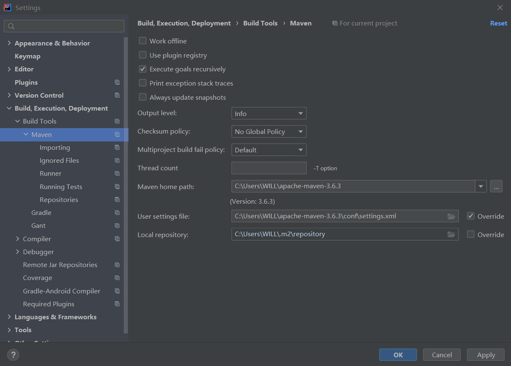
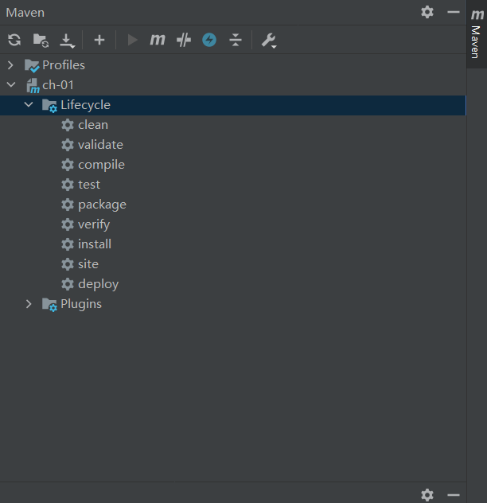

# Idea配置Maven:rocket:

## Idea设置:wrench:

1. 设置**maven**路径：

    

## Idea用法:hand:

1. 执行**maven**生命周期的各种操作：

    

### 依赖范围:red_circle:

~~~xml
<dependency>
    <groupId>junit</groupId>
    <artifactId>junit</artifactId>
    <version>4.11</version>
    <scope>test</scope>
</dependency>
~~~

**scope**：表示范围（默认**compile**）：

* **compile**：编译阶段；
* **test**：测试阶段；
* **provided**：安装时候不用提供