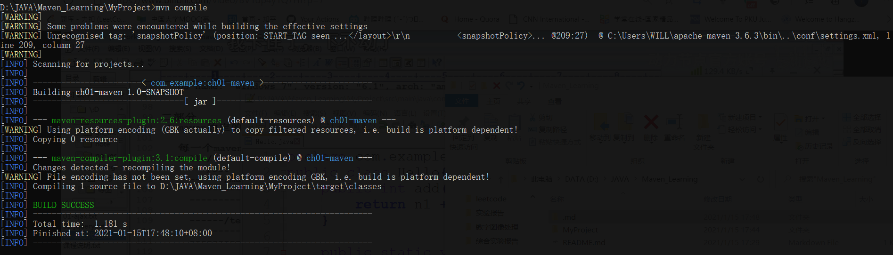
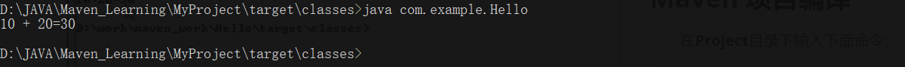
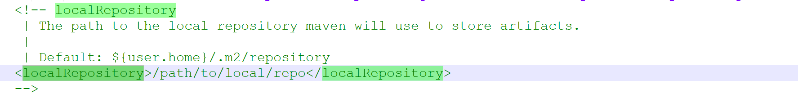
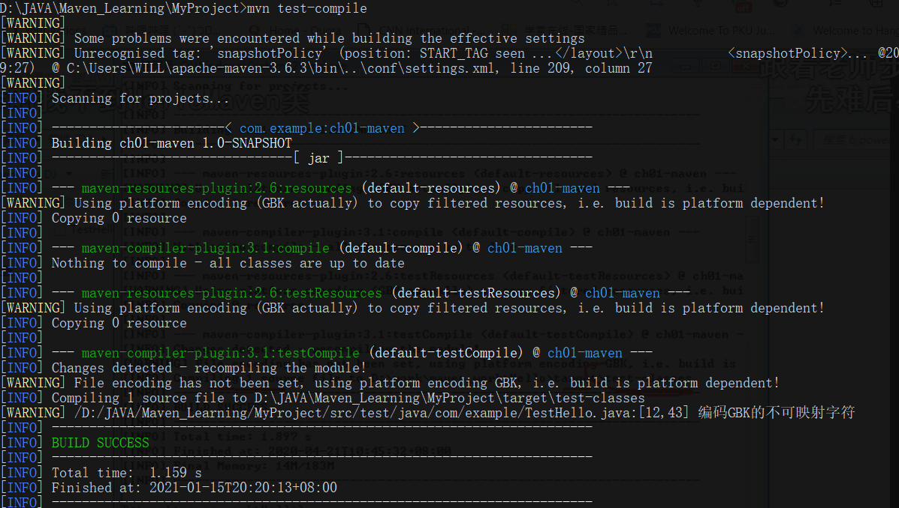
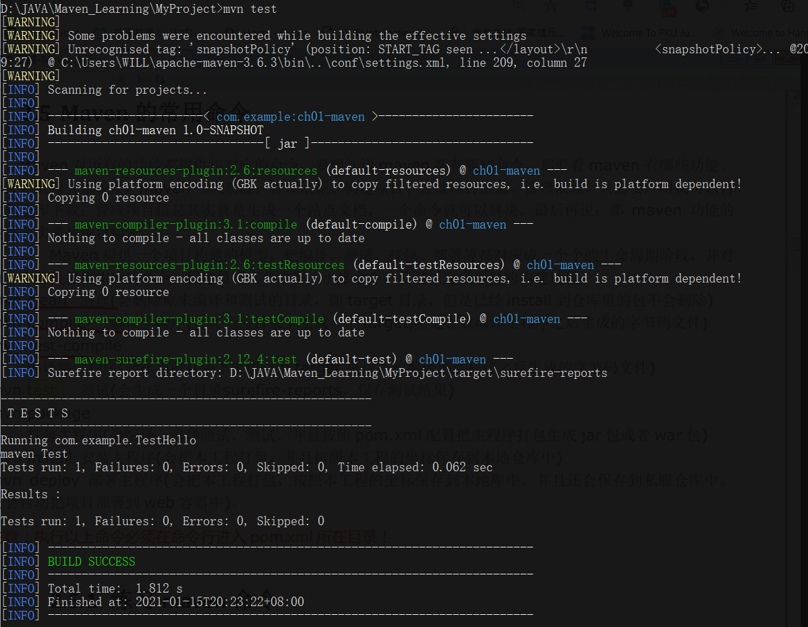
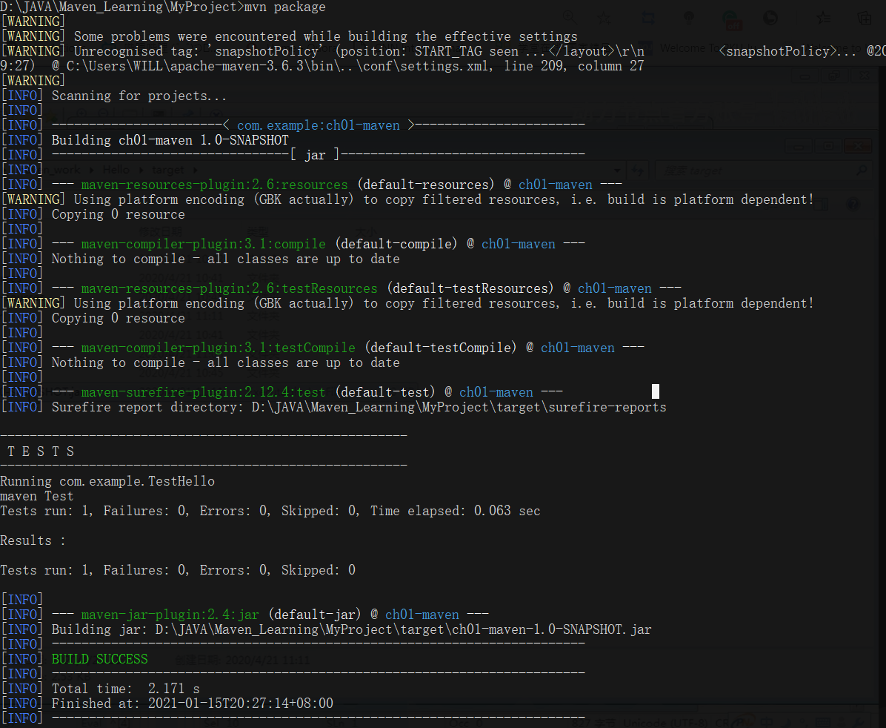

# Maven 基本知识:rocket:

## Maven 功能:fire:

1. 管理依赖：**jar**管理，下载，版本管理；
2. 构建项目：完成项目代码的编译、测试、打包、部署；

## Maven 安装:wrench:

1. 获取安装包：**zip文件**；
2. 解压缩文件到一个非中文目录；
3. 配置环境变量：**M2_HOME**，值是**maven**安装目录；
4. 在**path**中加入 **%M2_HOME%\bin**；
5. 测试**maven**安装，使用**mvn -v**查看版本。

## Maven 目录结构:file_folder:

~~~
Project
	|---src
	|---|---main
	|---|---|---java
	|---|---|----resources
	|---|---test
	|---|---|---java
	|---|---|---resources
	|---pom.xml
~~~

## Maven 项目编译:hammer:

在**Project**目录下输入下面命令：

~~~shell
mvn compile
~~~

**编译结果**，存放在**target**目录；

**运行**：

~~~
java [.class文件名]
~~~

## Maven 下载目录:open_file_folder:

**默认目录**：<u>C:\Users\WILL\.m2\repository</u>

### 修改下载目录：

修改**maven**安装目录下面 *conf/setting.xml*，修改**localRepository**标签为**自定义目录**：

## POM 文件:page_facing_up:

1. **坐标**：

    ~~~xml
    <groupId>公司域名的倒写</groupId>
    <artifactId>自定义项目名称</artifactId>
    <version>自定义版本号</version>
    ~~~

2. **打包**：

    ~~~xml
    packaging 打包后的扩展名， 默认jar
    ~~~

3. **依赖**：

    ~~~xml
    <dependencies>
        <dependency>
            <groupId>org.springframework.boot</groupId>
            <artifactId>spring-boot-starter-web</artifactId>
        </dependency>
    </dependencies>
    ~~~

4. **设置属性**：

    ~~~xml
    properties
    ~~~

5. **构建**：

    ~~~xml
    build
    ~~~

## Maven 命令:flags:

1. **mvn clean**：清理，删除**target**文件；

    

2. **mvn compile**：编译，生成**target**目录；

    

3. **mvn test-compile**：编译测试文件；

    

4. **mvn test**：进行测试，会把编译过程都执行一遍；

    

5. **mvn package**：打包；

    

6. **mvn install**：将**jar**包安装到本地仓库；

## junit 单元测试:memo:

1. **加入依赖**：在*pom.xml*文件中加入依赖：

    ~~~xml
    <dependency>
        <groupId>junit</groupId>
        <artifactId>junit</artifactId>
        <version>4.11</version>
        <scope>test</scope>
    </dependency>
    ~~~

2. **创建测试程序**：

    * 在**maven**项目下的*/src/test/java*下；
    * 测试类名称：**Test**+**测试类名**；
    * 测试方法名称：**Test**+**测试方法名**；