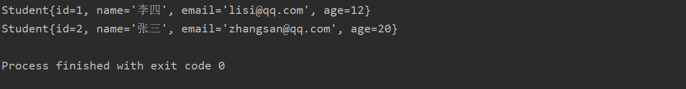
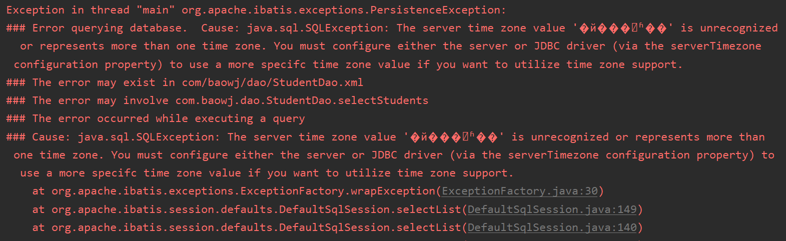

# Mybatis 新建项目:fire:

### 1. 添加依赖

在**pom.xml**文件添加**MyBatis**、**Mysql**依赖：

~~~xml
<dependency>
    <groupId>org.mybatis</groupId>
    <artifactId>mybatis</artifactId>
    <version>3.5.3</version>
</dependency>

<dependency>
    <groupId>mysql</groupId>
    <artifactId>mysql-connector-java</artifactId>
    <version>8.0.16</version>
</dependency>
~~~

### 2. 创建实体类:apple:

**实体类**对应**数据库表**中的一行数据，**类名**和**表名**一样，**属性名**和**列名**一样：

~~~java
public class Student {
    private Integer id;
    private String name;
    private String email;
    private Integer age;
}
~~~

### 3. 创建持久层的Dao接口:door:

~~~java
// 操作Student表的接口
public interface StudentDao {

    public List<Student> selectStudents();
}
~~~

### 4. 创建Sql映射文件:wrench:

1. 一般在接口（Dao）目录中；
2. 文件名和接口名保持一致；

**文件模板**：

~~~xml
<?xml version="1.0" encoding="UTF-8" ?>
<!DOCTYPE mapper
  PUBLIC "-//mybatis.org//DTD Mapper 3.0//EN"
  "http://mybatis.org/dtd/mybatis-3-mapper.dtd">
<mapper namespace="org.mybatis.example.BlogMapper">
  <select id="selectBlog" resultType="Blog">
    select * from Blog where id = #{id}
  </select>
</mapper>
~~~

1. **约束文件**：

    ~~~xml
    <!DOCTYPE mapper
      PUBLIC "-//mybatis.org//DTD Mapper 3.0//EN"
      "http://mybatis.org/dtd/mybatis-3-mapper.dtd">
    ~~~

    指定约束文件；

2. **mapper**：

    当前文件的根标签；

3. **namespace**：

    命名空间，使用**Dao**接口的全限定名称；

4. **select**：查询操作；

    * **id**：**sql语句**的唯一标识，使用接口中的方法名；
    * **resultType**：结果类型，是sql执行得到的**ResultSet**；

    ~~~xml
    <select id="selectStudents" resultType="com.baowj.domain.Student">
        select id, name, email, age from student order by id
    </select>
    ~~~

    

5. **update**：更新操作；

6. **insert**：插入操作；

7. **delete**：删除操作；

### 5. 创建MyBatis主配置文件

* **位置**：*src/main/resources*；
* **名称**：*mybatis.xml*；
* **功能**：定义数据库配置信息，失去了映射文件位置；
* **内容**：

~~~xml
<?xml version="1.0" encoding="UTF-8" ?>
<!DOCTYPE configuration
  PUBLIC "-//mybatis.org//DTD Config 3.0//EN"
  "http://mybatis.org/dtd/mybatis-3-config.dtd">
<configuration>
  <environments default="development">
    <environment id="development">
      <transactionManager type="JDBC"/>
      <dataSource type="POOLED">
                <property name="driver" value="com.mysql.jdbc.Driver"/>
                <property name="url" value="jdbc:mysql://localhost:3306/springdb"/>
                <property name="username" value="root"/>
                <property name="password" value="bwj678"/>
      </dataSource>
    </environment>
  </environments>
  <mappers>
    <mapper resource="com/baowj/dao/StudentDao.xml"/>
  </mappers>
</configuration>
~~~

* **mapper**：**Sql映射文件位置**；

* **输出日志**：

    ~~~xml
    <settings>
        <setting name="logImpl" value="STDOUT_LOGGING"/>
    </settings>
    ~~~

    

### 6. 测试

~~~java
public static void main(String[] args) throws IOException {
    // 1. 定义mybatis主配置文件名称路径
    String config = "mybatis.xml";
    // 2. 读取这个config文件
    InputStream in = Resources.getResourceAsStream(config);
    // 3. 创建SqlSessionFactoryBuilder
    SqlSessionFactoryBuilder builder = new SqlSessionFactoryBuilder();
    // 4. 创建SqlSessionFactory
    SqlSessionFactory factory = builder.build(in);
    // 5. 获取SqlSession对象
    SqlSession sqlSession = factory.openSession();
    // 6. 指定要执行sql语句标识
    String sqlId = "com.baowj.dao.StudentDao" + "." + "selectStudents";
    // 7. 执行sql语句
    List<Student> studentList = sqlSession.selectList(sqlId);
    // 8. 输出结果
    for(Student s:studentList)
    {
        System.out.println(s);
    }
    // 9. 关闭SqlSession对象
    sqlSession.close();
}
~~~

**运行结果**：

### 报错:rotating_light:

* **时区问题**：

    

    **解决方法**：在**MyBatis主配置文件**的**url**后面天降**?serverTimezone=UTC**；

    ~~~xml
    <property name="url" value="jdbc:mysql://localhost:3306/springdb?serverTimezone=UTC"/>
    ~~~

    