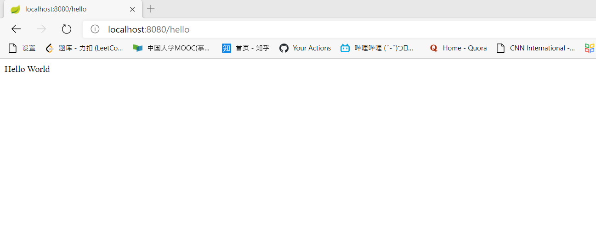
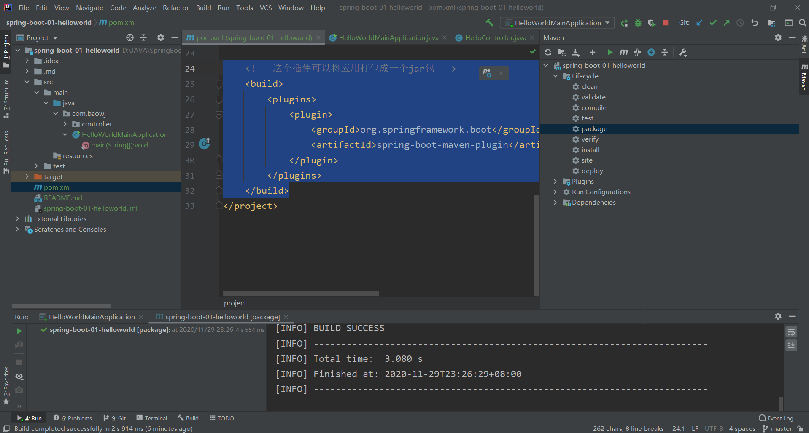
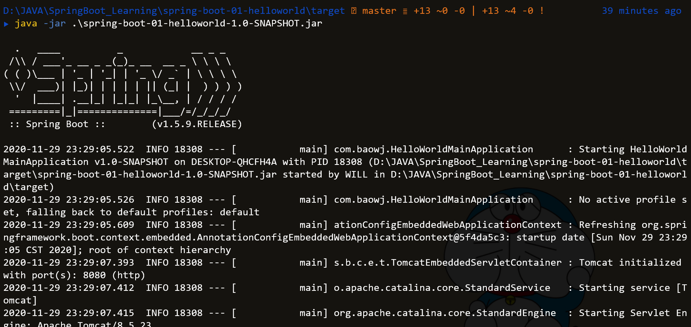

# 1.spring-boot "Hello World"

## 步骤

### 1、创建一个maven工程

### 2、导入spring-boot相关依赖

~~~~xml
<parent>
    <groupId>org.springframework.boot</groupId>
    <artifactId>spring-boot-starter-parent</artifactId>
    <version>1.5.9.RELEASE</version>
</parent>

<dependencies>
    <dependency>
        <groupId>org.springframework.boot</groupId>
        <artifactId>spring-boot-starter-web</artifactId>
    </dependency>
</dependencies>
~~~~

### 3、编写一个主程序：启动spring-boot应用

~~~java
/**
 * @SpringBootApplication 标注一个主程序类，表明是一个Spring Boot应用
 */
@SpringBootApplication
public class HelloWorldMainApplication {

    public static void main(String[] args) {
        // 启动应用
        SpringApplication.run(HelloWorldMainApplication.class, args);
    }
}
~~~

### 4、编写相关的Controller、Service

~~~java
@Controller
public class HelloController {

    @ResponseBody
    @RequestMapping("/hello")
    public String hello()
    {
        return "Hello World";
    }
}
~~~

### 5、运行主程序测试

### 6、简化部署

**插件**

~~~xml
<!-- 这个插件可以将应用打包成一个jar包 -->
<build>
    <plugins>
        <plugin>
            <groupId>org.springframework.boot</groupId>
            <artifactId>spring-boot-maven-plugin</artifactId>
        </plugin>
    </plugins>
</build>
~~~

**打包**

**部署运行**

*java -jar*命令

## 结果

