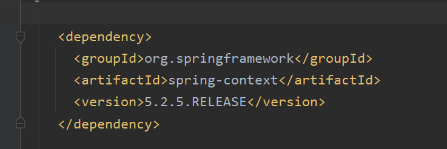

# Spring注解的用法

### 步骤

1. **添加依赖**

   

2. **添加注解**

3. 声明**组件扫描器**

4. 

5. 使用**注解创建对象**

### 详解

#### @Component

**使用方式**：在**实体类**的上面添加

~~~java
@Component(value = "myStudent")
public class Student {
}
~~~

**功能**：创建**spring对象**，等于\<bean\>功能

~~~java
@Component(value = "myStudent") <=> <bean id="myStudent" calss="com.baowj.study01.Student" />
~~~

**注意事项**：

*applicationContext.xml*要添加：

~~~java
<?xml version="1.0" encoding="UTF-8"?>
<beans xmlns="http://www.springframework.org/schema/beans"
       xmlns:xsi="http://www.w3.org/2001/XMLSchema-instance"
       xmlns:context="http://www.springframework.org/schema/context"
       xsi:schemaLocation="http://www.springframework.org/schema/beans
       http://www.springframework.org/schema/beans/spring-beans.xsd
       http://www.springframework.org/schema/aop
       http://www.springframework.org/schema/aop/spring-aop-4.0.xsd
       http://www.springframework.org/schema/context
       http://www.springframework.org/schema/context/spring-context.xsd">
~~~

